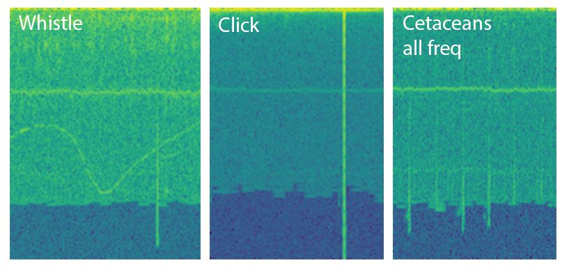
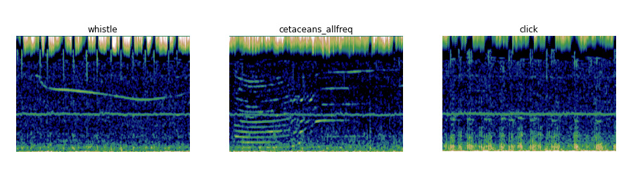
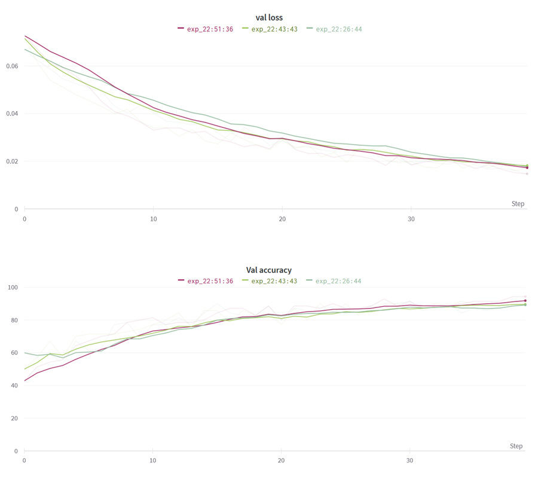

### Marine DataThon 2022

Este es el modelo convolucional presentado para resolver el primer desafío propuesto por la organización que trataba de clasificar sonidos marinos. En resumen desarrollamos un dataset de __espectrogramas__ personalizado que fueron reconstruidos por los otros miembros del equipo.

Los scores alcanzados con los datos originales llegaron las __70%__ de precisión mientras que con nuestros datos alcanzamos el __94%__. En resumen, nuestra propuesta era básicamente usar muestras de corta duración y modificarlas con un filtro no documentado en este repositorio.
Estas son algunas muestras modificadas. El mapa de color que se muestra, fue elegido con propósitos estéticos, no influye en el modelo.

Estos son gráficos de los resultados:

